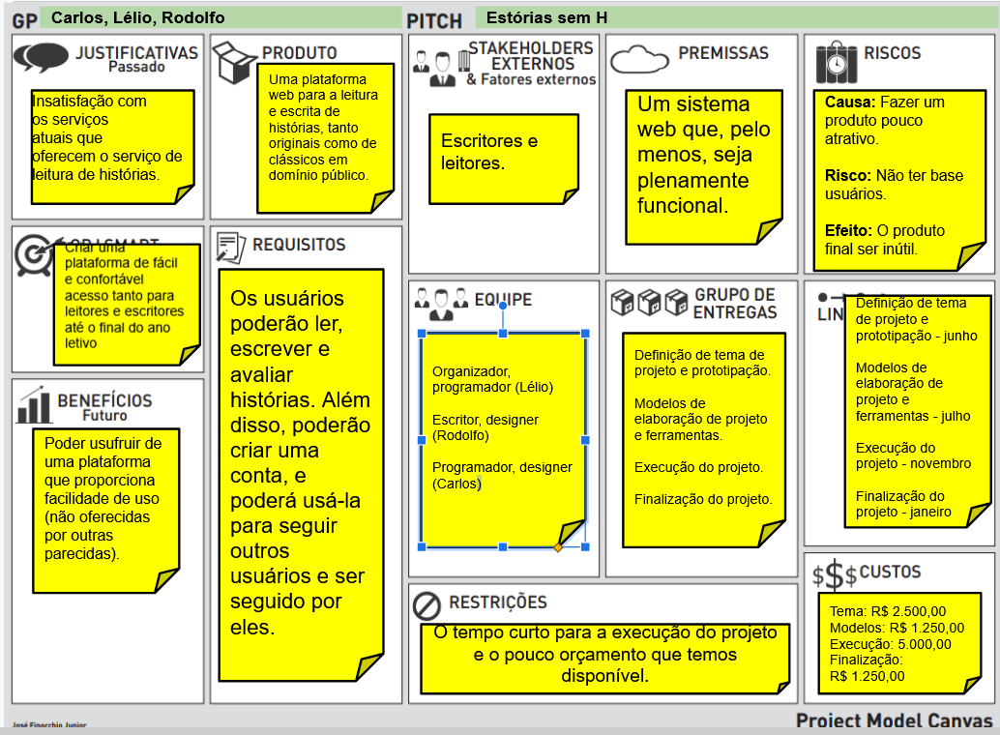
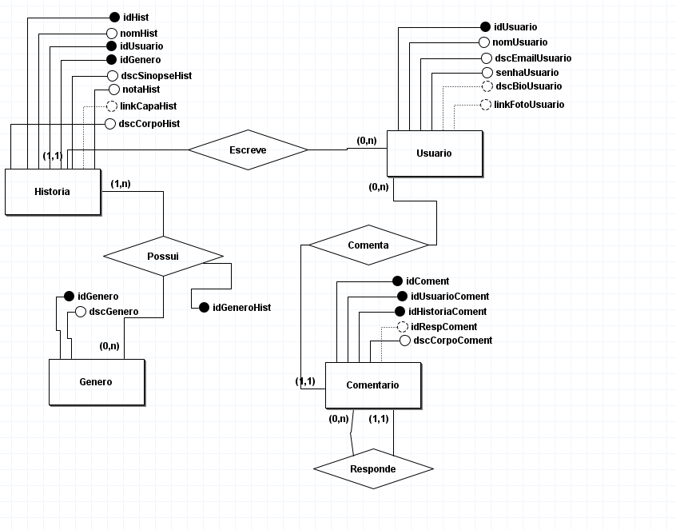
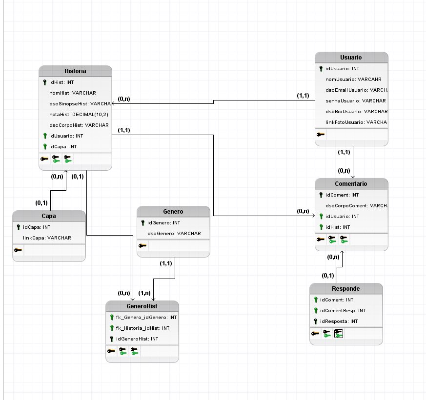

# TRABALHO DE PI:  Estórias sem H
Trabalho desenvolvido durante a disciplina de Banco de Dados do Integrado

# Sumário

### 1. COMPONENTES<br>
Integrantes do grupo<br>
Lélio Marcos Rangel Cunha leliomrcunha@gmail.com<br>
Carlos Eungênio Venturin Goldner carloseugventurin@gmail.com<br>
Rodolfo Müller do Amaral  email_terceiro_componente@dominio.com<br>

### 2.MINIMUNDO<br>
> O sistema proposto conterá as informações aqui detalhadas. Das Histórias serão armazenados o número, nome, sinopse, link de capa, nota e corpo. Dos Usuários serão armazenados o número, nome, email, senha, "bio" e link da foto. Cada Usuario pode ter várias histórias mas uma história pode ser escrita por apenas um usuário. Vale ressaltar que os usuários não são obrigados a escrever histórias. Dos Comentários são armazenados número, número da história, corpo do comentário e a identificação de resposta. Um usuário pode fazer vários comentários mas cada comentário pertence somente a um usuário. Não é obrigatório que o comentário seja uma resposta e os usuários podem não comentar. Gêneros possuem número e nome. "Possui" tem identificação relacionando gênero e história. Cada Gênero pode possuir várias histórias e cada história pode ter vários gêneros. Os gêneros não precisam ter histórias.
 

### 3.RASCUNHOS BÁSICOS DA INTERFACE (MOCKUPS)<br>


#### 3.1 QUAIS PERGUNTAS PODEM SER RESPONDIDAS COM O SISTEMA PROPOSTO?
> Relatórios gerados:
* Relatório que informe quais são as histórias criadas por cada usuário, incluindo: número da história, nome da história, número do usuário e nome do usuário.
* Relatório que informe quais são os comentários feitos por cada usuário, incluindo: número do comentário, corpo do comentário, número da história, número do usuário e nome do usuário.
* Relatório que informe quais são os gêneros de cada história, incluindo: número da história, nome da história, número do gênero e nome do gênero.
* Relatório que informe a quantidade de histórias por gênero, incluindo: número do gênero, nome do gênero e quantidade de histórias.
* Relatório que informe a quantidade de histórias escritas por cada usuário, incluindo: número do usuário, nome do usuário e quantidade de histórias.
 

### 4 TABELA DE DADOS DO SISTEMA:


 ### 5.PMC<br>
 <br>
 
 
 ### 6.MODELO CONCEITUAL<br>       

    
#### 6.1 Descrição dos dados 
    Historia: Tabela que armazena as informações relativas à história
    idHist: Campo que armazena o número identificador de cada história.
    nomHist: Campo que armazena o nome de cada história.
    dscSinopseHist: Campo que armazena a sinopse de cada história.
    linkCapaHist: Campo que armazena um link para a capa de cada história.
    notaHist: Campo que armazena o número da nota para cada história.
    dscCorpoHist: Campo que armazena o conteúdo de cada história.
    Usuario: Tabela que armazena as informações relativas ao usuário
    idUsuario: Campo que armazena o número identificador de cada usuário.
    nomUsuario: Campo que armazena o nome de cada usuário.
    dscEmailUsuario: Campo que armazena o endereço de email pertencente ao usuário.
    senhaUsuario: Campo que armazena a senha pertencente ao usuário correspondente.
    dscBioUsuario: Campo que armazena as informações da "bio" do usuário.
    linkFotoUsuario: Campo que armazena um link para a foto de cada usuário.
    Comentario: Tabela que armazena as informações relativas ao comentario feito pelo usuario em alguma história.
    idComent: Campo que armazena o número identificador de cada comentário.
    idUsuarioComent: Campo que armazena o número identificador do usuário que fez cada comentário.
    idHistoriaComent: Campo que armazena o número identificador da história que foi comentada.
    dscCorpoComent: Campo que armazena o conteúdo de cada comentário.
    idRespComent: Campo que armazena o identificador do comentário que está sendo respondido.
    Genero: Tabela que armazena as informações relativas ao gênero da história.
    idGenero: Campo que armazena o número identificador de cada gênero.
    dscGenero: Campo que armazena a denominação de cada gênero.


### 7	MODELO LÓGICO<br>


### 8	MODELO FÍSICO<br>
```sql
CREATE TABLE Historia (
    idHist INT PRIMARY KEY,
    nomHist VARCHAR,
    idUsuario INT,
    idGenero VARCHAR,
    dscSinopseHist VARCHAR,
    linkCapaHist VARCHAR,
    notaHist DECIMAL(10,2),
    dscCorpoHist VARCHAR
);

CREATE TABLE Usuario (
    idUsuario INT PRIMARY KEY,
    nomUsuario VARCHAR,
    dscEmailUsuario VARCHAR,
    senhaUsuario VARCHAR,
    dscBioUsuario VARCHAR,
    linkFotoUsuario VARCHAR
);

CREATE TABLE Comentario (
    idComent INT PRIMARY KEY,
    idUsuarioComent INT,
    idHistoriaComent INT,
    dscCorpoComent VARCHAR,
    idRespComent INT
);

CREATE TABLE Genero (
    idGenero INT PRIMARY KEY,
    dscGenero VARCHAR
);

CREATE TABLE Possui (
    fk_Historia_idHist INT,
    fk_Genero_idGenero INT,
    idGeneroHist VARCHAR PRIMARY KEY
);

ALTER TABLE Historia ADD CONSTRAINT FK_Historia_2
    FOREIGN KEY (idUsuario)
    REFERENCES Usuario (idUsuario);

ALTER TABLE Historia ADD CONSTRAINT FK_Historia_3
    FOREIGN KEY (idGenero)
    REFERENCES Possui (idGeneroHist);

ALTER TABLE Comentario ADD CONSTRAINT FK_Comentario_2
    FOREIGN KEY (idUsuarioComent)
    REFERENCES Usuario (idUsuario);

ALTER TABLE Comentario ADD CONSTRAINT FK_Comentario_3
    FOREIGN KEY (idRespComent)
    REFERENCES Comentario (idComent);

ALTER TABLE Possui ADD CONSTRAINT FK_Possui_3
    FOREIGN KEY (fk_Genero_idGenero)
    REFERENCES Genero (idGenero)
    ON DELETE SET NULL;
```
        
       
### 9	INSERT APLICADO NAS TABELAS DO BANCO DE DADOS<br>
```
INSERT INTO usuario 
VALUES (1,'José de Alencar','josedealencar@hotmail.com', 'c7cc12f6deb215d2381bb9ac2c9c6c70', 'José Martiniano de Alencar foi um escritor e político brasileiro. É notável como escritor por ter sido o fundador do romance de temática nacional, e por ser o patrono da cadeira fundada por Machado de Assis na Academia Brasileira de Letras.','https://bit.ly/3eM4t6G'),
(2, 'Machado de Assis', 'machadodeassis@yahoo.com', '96be35715459112775cdd0f17f03d9aa', 'Joaquim Maria Machado de Assis foi um escritor brasileiro, considerado por muitos críticos, estudiosos, escritores e leitores um dos maiores senão o maior nome da literatura do Brasil.', 'https://bit.ly/3hXmtgn'),
(3, 'Dante Alighieri', 'dante0080@gmail.com', '956d62eb88f1fadf63d3e9613df08e69', 'Dante Alighieri foi um escritor, poeta e político florentino, nascido na atual Itália.', 'https://bit.ly/36QeYl8'),
(4, 'Aluísio Azevedo', 'aluisioaze@gmail.com', '4e234d26e1c27a3396fcab6f0c94ae44', 'Aluísio Tancredo Gonçalves de Azevedo foi um romancista, contista, cronista, diplomata, caricaturista e jornalista brasileiro; além de desenhista e pintor.', 'https://bit.ly/3wZbk2I');

INSERT INTO comentario
VALUES (1,2,2,'Bom!',null),
(2,2,3,'Muito Bom!',null),
(3,1,1,'Não gostei!',null),
(4,4,1,'Discordo...',3);

INSERT INTO genero
VALUES (1, 'Ficção'),
(2, 'Não ficção'),
(3,'Ficção científica'),
(4, 'Ficção fantástica'),
(5, 'Romance'),
(6, 'Conto'),
(7, 'Biografia');

INSERT INTO possui
VALUES (1, 1, 1),
(1, 2, 2),
(1, 3, 3),
(1, 4,4),
(1, 5,5),
(1, 6,6);

INSERT INTO historia
VALUES (1, 'Cinco Minutos',1,1,'Cinco Minutos é romance de José de Alencar. Cinco Minutos, assim como “A Viuvinha“, foram escritos no início da carreira do autor. Assim como os outros romances caracterizados pelo romantismo ingênuo de Alencar, esses dois não fogem à regra, são feitos aos moldes de folhetim, curtos, quase infantis.','https://bit.ly/36QaPxA', 8, 'É uma história curiosa a que lhe vou contar, minha prima. Mas é uma história e não um romance. Há mais de dois anos, seriam seis horas da tarde, dirigi- -me ao Rocio para tomar o ônibus de Andaraí. Sabe que sou o homem menos pontual que há neste mundo; entre os meus imensos defeitos e as minhas poucas qualidades, não conto a pontualidade, essa virtude dos reis e esse mau costume dos ingleses. Entusiasta da liberdade, não posso admitir de modo algum que um homem se escravize ao seu relógio e regule as suas ações pelo movimento de uma pequena agulha de aço ou pelas oscilações de uma pêndula.'),
(2, 'Memórias Póstumas de Brás Cubas', 2, 1, 'Memórias Póstumas de Brás Cubas retrata a escravidão, as classes sociais, o cientificismo e o positivismo da época, chegando a criar, inclusive, uma nova filosofia', 'https://bit.ly/36W0gc8', 4, 'Algum tempo hesitei se devia abrir estas memórias pelo princípio ou  pelo fim, isto é, se poria em primeiro lugar o meu nascimento ou a  minha morte. Suposto o uso vulgar seja começar pelo nascimento,  duas considerações me levaram a adotar diferente método: a  primeira é que eu não sou propriamente um autor defunto, mas um  defunto autor, para quem a campa foi outro berço; a segunda é que  o escrito ficaria assim mais galante e mais novo. Moisés, que também  contou a sua morte, não a pôs no intróito, mas no cabo: diferença  radical entre este livro e o Pentateuco.'),
(3, 'Dom Casmurro', 2, 1, '"Dom Casmurro" conta a história de Bento Santiago (Bentinho), apelidado de Dom Casmurro por ser calado e introvertido.', 'https://bit.ly/2UvSzak', 7, 'Uma noite destas, vindo da cidade para o Engenho Novo, encontrei num trem da Central um rapaz aqui do bairro, que eu conheço de vista e de chapéu. Cumprimentou-me, sentou-se ao pé de mim, falou da lua e dos ministros, e acabou recitando-me versos. A viagem era curta, e os versos pode ser que não fossem inteiramente maus. Sucedeu, porém, que, como eu estava cansado, fechei os olhos três ou quatro vezes; tanto bastou para que ele interrompesse a leitura e metesse os versos no bolso.'),
(4, 'A Divina Comédia', 3, 1, 'A Divina Comédia é basicamente a história da conversão de um pecador ao caminho de Deus.', 'https://bit.ly/3hYWDZo', 2, 'Dante, perdido numa selva escura, erra nela toda a noite. Saindo ao amanhecer, começa a subir por uma colina, quando lhe atravessam a passagem uma pantera, um leão e uma loba, que o repelem para a selva. Aparece-lhe então a imagem de Virgílio, que o reanima e se oferece a tirá-lo de lá, fazendo-o passar pelo Inferno e pelo Purgatório. Beatriz, depois, o guiará ao Paraíso. Dante o segue.'),
(5, 'O Cortiço', 4, 5, 'O Cortiço denuncia a exploração e as péssimas condições de vida dos moradores das estalagens ou dos cortiços cariocas do final do século XIX.', 'https://bit.ly/3zAsWUw', 6, 'João Romão foi, dos treze aos vinte e cinco anos, empregado de um vendeiro que enriqueceu entre as quatro paredes de uma suja e obscura taverna nos refolhos do bairro do Botafogo; e tanto economizou do pouco que ganhara nessa dúzia de anos, que, ao retirar-se o patrão para a terra, lhe deixou, em pagamento de ordenados vencidos, nem só a venda com o que estava dentro, como ainda um conto e quinhentos em dinheiro.'),
(6, 'O Alienista', 2, 6, 'Após conquistar respeito em sua carreira de médico na Europa e no Brasil, o Dr. Simão Bacamarte retorna à sua terra-natal, Itaguaí, para se dedicar ainda mais a sua profissão.', 'https://bit.ly/3rANqK0', 6, 'As crônicas da vila de Itaguaí dizem que em tempos remotos vivera ali um certo médico, o Dr. Simão Bacamarte, filho da nobreza da terra e o maior dos médicos do Brasil, de Portugal e das Espanhas.'),
(7, 'Missa do Galo', 2, 6, '“Missa do Galo” é narrado em primeira pessoa, por Nogueira, que relembra quando era um jovem de 17 anos que tinha ido ao Rio de Janeiro para estudar e que foi hospedado na casa do escrivão Meneses (viúvo de sua prima).', 'https://bit.ly/3i6lwT3', 7, 'NUNCA PUDE entender a conversação que tive com uma senhora, há muitos anos, contava eu dezessete, ela trinta. Era noite de Natal. Havendo ajustado com um vizinho irmos à missa do galo, preferi não dormir; combinei que eu iria acordá-lo à meia-noite.');
```
### 10	TABELAS E PRINCIPAIS CONSULTAS<br>
#### 10.1	CONSULTAS DAS TABELAS COM TODOS OS DADOS INSERIDOS (Todas) <br>
#### 10.2 PRINCIPAIS CONSULTAS DO SISTEMA 
 Inserir as principais consultas (relativas aos 5 principais relatórios) definidas previamente no iten 3.1 deste template.
 <br>
  a) Você deve apresentar as consultas em formato SQL para cad um dos relatórios.
 <br>
  b) Além da consulta deve ser apresentada uma imagem com o resultado obtido para cada consulta.
 <br>
 <br>
 
 ### 11 Gráficos, relatórios, integração com Linguagem de programação e outras solicitações.<br>
     OBS: Observe as instruções relacionadas a cada uma das atividades abaixo.<br>
 #### 11.1	Integração com Linguagem de programação; <br>
 #### 11.2	Desenvolvimento de gráficos/relatórios pertinentes, juntamente com demais <br>
 #### solicitações feitas pelo professor. <br>
 <br>
 <br>
 
 ### 12 Slides e Apresentação em vídeo. <br>
     OBS: Observe as instruções relacionadas a cada uma das atividades abaixo.<br>
 #### 12.1 Slides; <br>
 #### 12.2 Apresentação em vídeo <br>
 <br>
 <br>   


    
##### About Formatting
    https://help.github.com/articles/about-writing-and-formatting-on-github/
    
##### Basic Formatting in Git
    
    https://help.github.com/articles/basic-writing-and-formatting-syntax/#referencing-issues-and-pull-requests
   
    
##### Working with advanced formatting
    https://help.github.com/articles/working-with-advanced-formatting/

#### Mastering Markdown
    https://guides.github.com/features/mastering-markdown/

### OBSERVAÇÕES IMPORTANTES

#### Todos os arquivos que fazem parte do projeto (Imagens, pdfs, arquivos fonte, etc..), devem estar presentes no GIT. Os arquivos do projeto vigente não devem ser armazenados em quaisquer outras plataformas.
1. Caso existam arquivos com conteúdos sigilosos, comunicar o professor que definirá em conjunto com o grupo a melhor forma de armazenamento do arquivo.

#### Todos os grupos deverão fazer Fork deste repositório e dar permissões administrativas ao usuário deste GIT, para acompanhamento do trabalho.

#### Os usuários criados no GIT devem possuir o nome de identificação do aluno (não serão aceitos nomes como Eu123, meuprojeto, pro456, etc). Em caso de dúvida comunicar o professor.


Link para BrModelo:<br>
http://sis4.com/brModelo/brModelo/download.html
<br>


Link para curso de GIT<br>

