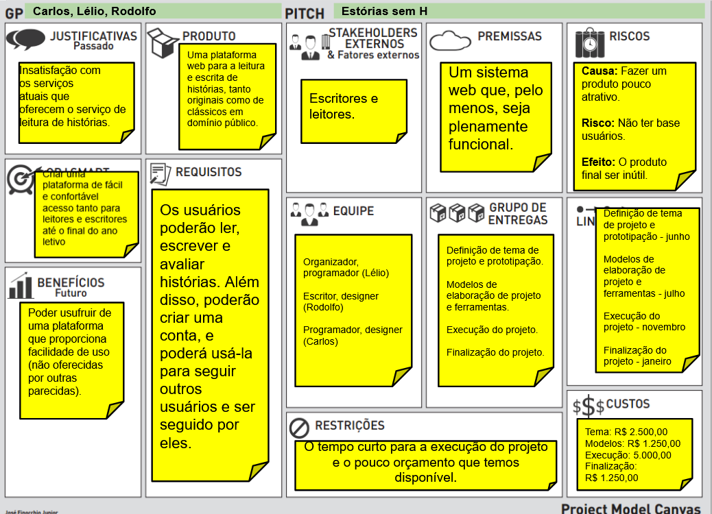
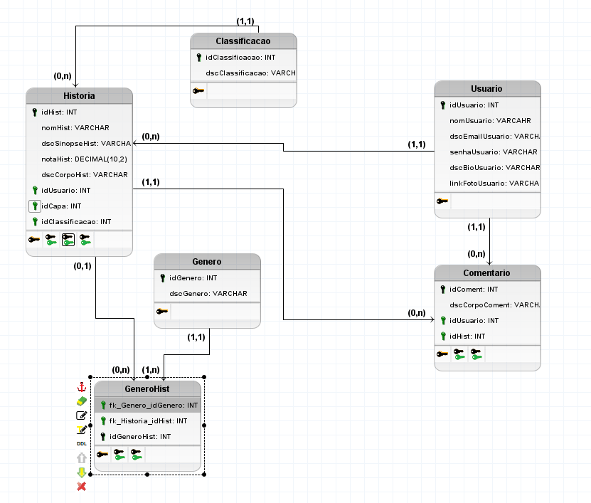

# TRABALHO DE PI:  Histórias sem E
Trabalho desenvolvido durante a disciplina de Banco de Dados do Integrado

# Sumário

### 1. COMPONENTES<br>
Integrantes do grupo<br>
Lélio Marcos Rangel Cunha email_primeiro_componente@dominio.com<br>
Carlos Eungênio Venturin Goldner carloseugventurin@gmail.com<br>
Rodolfo Müller do Amaral  email_terceiro_componente@dominio.com<br>

### 2.MINIMUNDO<br>
Descrever o mini-mundo! (Não deve ser maior do que 30 linhas, se necessário resumir para justar)
Entrevista com o usuário e identificação dos requisitos.(quando for o caso de sistemas com cliente real)
Descrição textual das regras de negócio definidas como um subconjunto do mundo real cujos elementos são propriedades que desejamos incluir, processar, armazenar, gerenciar, atualizar, e que descrevem a proposta/solução a ser desenvolvida.
<br>

> O sistema proposto conterá as informações aqui detalhadas. Das Histórias serão armazenados o número, nome, sinopse, link de capa, nota e corpo. Dos Usuários serão armazenados o número, nome, email, senha, "bio" e link da foto. Cada Usuario pode ter várias histórias mas uma história pode ser escrita por apenas um usuário. Vale ressaltar que os usuários não são obrigados a escrever histórias. Dos Comentários são armazenados número, número da história, corpo do comentário e a identificação de resposta. Um usuário pode fazer vários comentários mas cada comentário pertence somente a um usuário. Não é obrigatório que o comentário seja uma resposta e os usuários podem não comentar. Gêneros possuem número e nome. "Possui" tem identificação relacionando gênero e história. Cada Gênero pode possuir várias histórias e cada história pode ter vários gêneros. Os gêneros não precisam ter histórias.
 

### 3.RASCUNHOS BÁSICOS DA INTERFACE (MOCKUPS)<br>


#### 3.1 QUAIS PERGUNTAS PODEM SER RESPONDIDAS COM O SISTEMA PROPOSTO?
    a) O sistema proposto poderá fornecer quais tipos de relatórios e informaçes? 
    b) Crie uma lista com os 5 principais relatórios que poderão ser obtidos por meio do sistema proposto!
    
> A Empresa DevCom precisa inicialmente dos seguintes relatórios:
* Relatório que informe quais são os gerentes de cada departamento incluindo as seguintes informações: número do departamento,  nome do departamento, e nome do gerente.
* Relatório de empregados por projeto incluindo as seguintes informações: número do projeto, nome do projeto, rg do empregado, nome do empregado e quantidade de horas de trabalho do empregado alocadas ao projeto.
* Relatório de empregados com dependentes incluindo as seguintes informações: rg do empregado, nome do empregado, nome do dependente, tipo de relação, data de nascimento do dependente e sexo do dependente.
* Relatório com a quantidade de empregados por cada departamento incluindo as seguintes informações: nome do departamento, supervisor e quantidade de empregados alocados no departamento.
* Relatório de supervisores e supervisionados incluindo as seguintes informações: nome do supervisor e nome do supervisionado.
 

### 4 TABELA DE DADOS DO SISTEMA:


 ### 5.PMC<br>
 
 a) inclusão do PMC desenvolvido pelo grupo
 
 
 ### 6.MODELO CONCEITUAL<br>       

    
      
    
#### 6.1 Descrição dos dados 
    Historia: Tabela que armazena as informações relativas à história
    Usuario: Tabela que armazena as informações relativas ao usuário
    Comentario: Tabela que armazena as informações relativas ao comentario feito pelo usuario em alguma história
    Genero: Tabela que armazena as informações relativas ao gênero da história.


### 7	MODELO LÓGICO<br>


### 8	MODELO FÍSICO<br>
```sql
CREATE TABLE Historia (
    idHist INT PRIMARY KEY,
    nomHist VARCHAR,
    idUsuario INT,
    idGenero VARCHAR,
    dscSinopseHist VARCHAR,
    linkCapaHist VARCHAR,
    notaHist DECIMAL(10,2),
    dscCorpoHist VARCHAR
);

CREATE TABLE Usuario (
    idUsuario INT PRIMARY KEY,
    nomUsuario VARCHAR,
    dscEmailUsuario VARCHAR,
    senhaUsuario VARCHAR,
    dscBioUsuario VARCHAR,
    linkFotoUsuario VARCHAR
);

CREATE TABLE Comentario (
    idComent INT PRIMARY KEY,
    idUsuarioComent INT,
    idHistoriaComent INT,
    dscCorpoComent VARCHAR,
    idRespComent INT
);

CREATE TABLE Genero (
    idGenero INT PRIMARY KEY,
    dscGenero VARCHAR
);

CREATE TABLE Possui (
    fk_Historia_idHist INT,
    fk_Genero_idGenero INT,
    idGeneroHist VARCHAR PRIMARY KEY
);

ALTER TABLE Historia ADD CONSTRAINT FK_Historia_2
    FOREIGN KEY (idUsuario)
    REFERENCES Usuario (idUsuario);

ALTER TABLE Historia ADD CONSTRAINT FK_Historia_3
    FOREIGN KEY (idGenero)
    REFERENCES Possui (idGeneroHist);

ALTER TABLE Comentario ADD CONSTRAINT FK_Comentario_2
    FOREIGN KEY (idUsuarioComent)
    REFERENCES Usuario (idUsuario);

ALTER TABLE Comentario ADD CONSTRAINT FK_Comentario_3
    FOREIGN KEY (idRespComent)
    REFERENCES Comentario (idComent);

ALTER TABLE Possui ADD CONSTRAINT FK_Possui_3
    FOREIGN KEY (fk_Genero_idGenero)
    REFERENCES Genero (idGenero)
    ON DELETE SET NULL;
```
        
       
### 9	INSERT APLICADO NAS TABELAS DO BANCO DE DADOS<br>
        a) inclusão das instruções de inserção dos dados nas tabelas criadas pelo script de modelo físico
        (Drop para exclusão de tabelas + create definição de para tabelas e estruturas de dados 
 <br> + insert para dados a serem inseridos)
        b) Criar um novo banco de dados para testar a restauracao 
        (em caso de falha na restauração o grupo não pontuará neste quesito)
        c) formato .SQL


### 10	TABELAS E PRINCIPAIS CONSULTAS<br>
    OBS: Incluir para cada tópico as instruções SQL + imagens (print da tela) mostrando os resultados.<br>
#### 10.1	CONSULTAS DAS TABELAS COM TODOS OS DADOS INSERIDOS (Todas) <br>
#### 10.2 PRINCIPAIS CONSULTAS DO SISTEMA 
 Inserir as principais consultas (relativas aos 5 principais relatórios) definidas previamente no iten 3.1 deste template.
 <br>
  a) Você deve apresentar as consultas em formato SQL para cad um dos relatórios.
 <br>
  b) Além da consulta deve ser apresentada uma imagem com o resultado obtido para cada consulta.
 <br>
 <br>
 
 ### 11 Gráficos, relatórios, integração com Linguagem de programação e outras solicitações.<br>
     OBS: Observe as instruções relacionadas a cada uma das atividades abaixo.<br>
 #### 11.1	Integração com Linguagem de programação; <br>
 #### 11.2	Desenvolvimento de gráficos/relatórios pertinentes, juntamente com demais <br>
 #### solicitações feitas pelo professor. <br>
 <br>
 <br>
 
 ### 12 Slides e Apresentação em vídeo. <br>
     OBS: Observe as instruções relacionadas a cada uma das atividades abaixo.<br>
 #### 12.1 Slides; <br>
 #### 12.2 Apresentação em vídeo <br>
 <br>
 <br>   


    
##### About Formatting
    https://help.github.com/articles/about-writing-and-formatting-on-github/
    
##### Basic Formatting in Git
    
    https://help.github.com/articles/basic-writing-and-formatting-syntax/#referencing-issues-and-pull-requests
   
    
##### Working with advanced formatting
    https://help.github.com/articles/working-with-advanced-formatting/

#### Mastering Markdown
    https://guides.github.com/features/mastering-markdown/

### OBSERVAÇÕES IMPORTANTES

#### Todos os arquivos que fazem parte do projeto (Imagens, pdfs, arquivos fonte, etc..), devem estar presentes no GIT. Os arquivos do projeto vigente não devem ser armazenados em quaisquer outras plataformas.
1. Caso existam arquivos com conteúdos sigilosos, comunicar o professor que definirá em conjunto com o grupo a melhor forma de armazenamento do arquivo.

#### Todos os grupos deverão fazer Fork deste repositório e dar permissões administrativas ao usuário deste GIT, para acompanhamento do trabalho.

#### Os usuários criados no GIT devem possuir o nome de identificação do aluno (não serão aceitos nomes como Eu123, meuprojeto, pro456, etc). Em caso de dúvida comunicar o professor.


Link para BrModelo:<br>
http://sis4.com/brModelo/brModelo/download.html
<br>


Link para curso de GIT<br>

